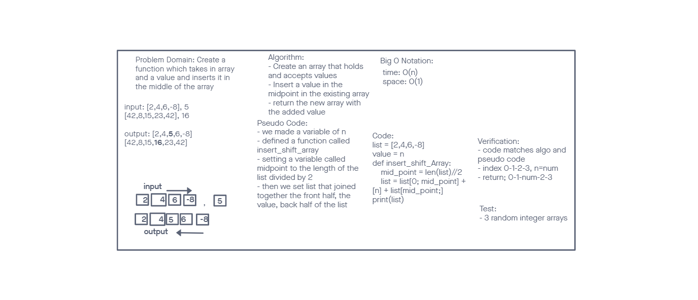

# array_insert_shift

My Partner for this code challenge was Osborn Del Angel.

# Insert to Middle of an Array

-Insert a value at the midpoint of the array.
-Return the modified array with the value added.

## Whiteboard Process

## Approach & Efficiency

- Create an array that holds and acccepts values
- Find the midpoint of the array/list
- Insert the new value in at the mid point
- Append the first half of the array elements + the value + the end/second half of the array elements
  -Return the modified string.

#Solution:

list = [2,4,6,-8]
value = n
def insert_shift_array:
mid_point = len(list)//2
list = list[0:mid_point] + n + [mid_point:]
print(list)
